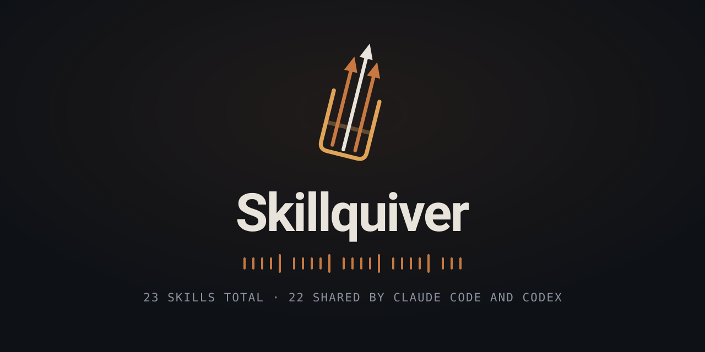

<div align="center">



[](LICENSE)


A curated library of 25 Agent Skills for Claude Code, installable as a plugin or as project skills under [`.claude/skills/`](.claude/skills/).

**[What each skill does, and when it steps in →](https://drizzy07x.github.io/Skillquiver/)**

</div>

## Installation

### Plugin (recommended)

Inside an interactive Claude Code session:

```
/plugin marketplace add Drizzy07x/Skillquiver
/plugin install skillquiver@skillquiver
```

Or from any terminal (works even where `/plugin` slash commands are not available):

```bash
claude plugin marketplace add Drizzy07x/Skillquiver
claude plugin install skillquiver@skillquiver --scope user
```

All 25 skills load globally (every project). Update later with `/plugin update skillquiver` or `claude plugin update skillquiver`.

> **Note:** `/plugin` slash commands only exist in the interactive Claude Code CLI. In other environments (IDE integrations, non-interactive sessions), use the `claude plugin` terminal commands above or the manual install below.

### Manual

**Per project:** clone into a project (or copy `.claude/skills/` into an existing one) and Claude Code picks the skills up as project skills automatically.

**Globally:** copy the skill folders into `~/.claude/skills/` and they load in every project.

## Skills

### Planning

| Skill | What it does |
|-------|--------------|
| [brainstorming](.claude/skills/brainstorming/SKILL.md) | Explores user intent, requirements, and design before implementation. |
| [writing-plans](.claude/skills/writing-plans/SKILL.md) | Writes a task-by-task implementation plan document from a spec, before touching code. |
| [executing-plans](.claude/skills/executing-plans/SKILL.md) | Executes a written implementation plan inline, task by task, stopping only on blockers. |
| [subagent-driven-development](.claude/skills/subagent-driven-development/SKILL.md) | Executes a plan by dispatching one subagent per task with per-task review gates, keeping orchestrator context small. |
| [dispatching-parallel-agents](.claude/skills/dispatching-parallel-agents/SKILL.md) | Dispatches parallel subagents, one per independent domain, to handle unrelated problems concurrently. |

### Execution

| Skill | What it does |
|-------|--------------|
| [test-driven-development](.claude/skills/test-driven-development/SKILL.md) | Enforces test-first red-green-refactor: failing test, minimal code to pass, verify green. |
| [solve-efficiently](.claude/skills/solve-efficiently/SKILL.md) | Route work efficiently with progressive context discovery, matched effort, and durable project mapping. |
| [execute-durably](.claude/skills/execute-durably/SKILL.md) | Run long or interruption-prone work against an external state file with falsifiable criteria and an append-only evidence log. |
| [refactor-safely](.claude/skills/refactor-safely/SKILL.md) | Refactor working code and land changes in untested legacy code without altering observable behavior. |
| [using-git-worktrees](.claude/skills/using-git-worktrees/SKILL.md) | Ensures an isolated workspace exists via native tools or git worktree fallback before feature work. |
| [communicate-clearly](.claude/skills/communicate-clearly/SKILL.md) | Control report verbosity with the shortest profile that preserves evidence; explain external sources in plain language. |

### Verification & debugging

| Skill | What it does |
|-------|--------------|
| [diagnose-systematically](.claude/skills/diagnose-systematically/SKILL.md) | Find the cause of a defect through observable evidence: reproduce, minimize, test falsifiable hypotheses one variable at a time. |
| [verification-before-completion](.claude/skills/verification-before-completion/SKILL.md) | Requires running verification commands and confirming output before any success claim; evidence before assertions. |
| [verify-work](.claude/skills/verify-work/SKILL.md) | Independently audit finished work: verify a delivery or completion claim against real evidence. |
| [research-systematically](.claude/skills/research-systematically/SKILL.md) | Freeze the question before collecting results, bind every claim to a source, pin docs to the installed dependency version. |

### Code review

| Skill | What it does |
|-------|--------------|
| [requesting-code-review](.claude/skills/requesting-code-review/SKILL.md) | Dispatches a code-reviewer subagent to check finished work against requirements before it merges. |
| [receiving-code-review](.claude/skills/receiving-code-review/SKILL.md) | Processes review feedback with rigor: verify each claim against the code before implementing, push back with evidence. |
| [finishing-a-development-branch](.claude/skills/finishing-a-development-branch/SKILL.md) | Guides integration of a finished branch: verify tests, present merge/PR/keep/discard options, clean up worktrees. |

### UI & automation

| Skill | What it does |
|-------|--------------|
| [design-ui](.claude/skills/design-ui/SKILL.md) | Turn visual intent into inspectable constraints, implement UI as one coherent system, and verify the rendered result. |
| [automate-ui](.claude/skills/automate-ui/SKILL.md) | Drive web and desktop UIs adaptively while capturing evidence that separates navigation from behavioral proof. |

### Prompt & skill engineering

| Skill | What it does |
|-------|--------------|
| [engineer-prompts](.claude/skills/engineer-prompts/SKILL.md) | Build or audit a prompt contract with explicit outcomes, boundaries, permissions, required evidence, and stop conditions. |
| [writing-skills](.claude/skills/writing-skills/SKILL.md) | Creates, edits, and tests Agent Skills: frontmatter rules, trigger descriptions, verification before deployment. |
| [skill-generalizer](.claude/skills/skill-generalizer/SKILL.md) | Converts local or personal skills into publishable ones: strips private paths, credentials, and internal hosts. |
| [skill-personalizer](.claude/skills/skill-personalizer/SKILL.md) | Audits and adapts community or newly installed skills to the user's tools, directories, and habits. |
| [skill-miner](.claude/skills/skill-miner/SKILL.md) | Mines session history and repeated local work to surface recurring workflows worth turning into new skills. |

## License

[MIT](LICENSE)
